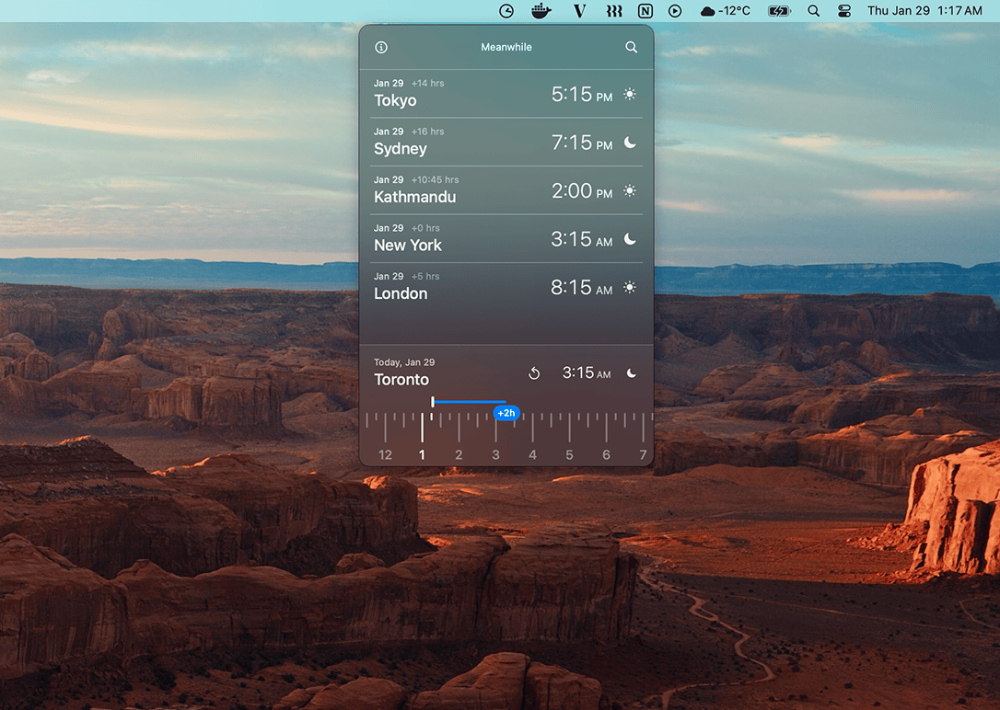

# Meanwhile

A lightweight macOS utility for calculating time differences across timezones.

## Why This Exists

We work with people around the world. We have friends in different cities. We collaborate across continents. But calculating "what time will it be there when it's 3 PM here?" is surprisingly difficult.

Meanwhile makes it simple: add your cities and scrub through time.

## How to Use

1. Download and unzip
2. Drag Meanwhile.app to your Applications folder
3. Open and add cities
4. Click any city to make it home
5. Scrub the time slider to calculate differences

## Installation

[Download the latest release →](https://github.com/sangamdai/meanwhile/releases)

**macOS Sequoia or later required**

No signup. No data collection. Completely offline. Free to use.

### ⚠️ First Launch

Since the app isn't signed with an Apple Developer certificate, macOS Gatekeeper will block it on first launch. This is normal for free, open-source apps.

**To fix it:**

- Go to **System Settings → Privacy & Security**
- Scroll down to see "Meanwhile was blocked"
- Click **"Open Anyway"**

---
